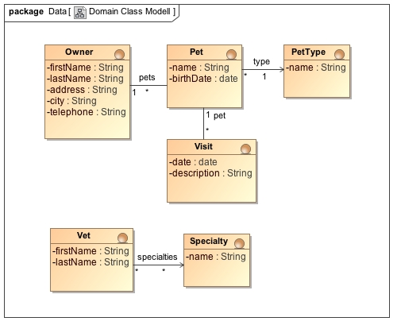
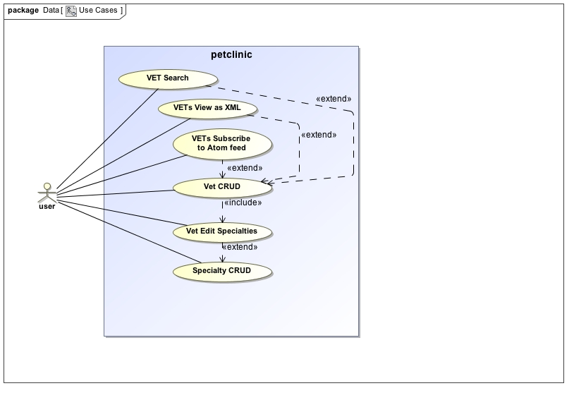
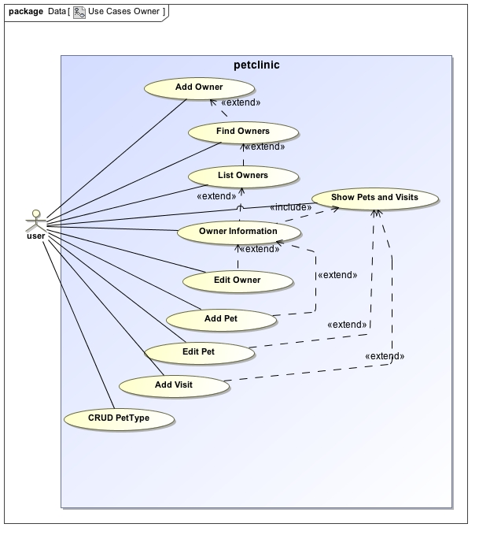
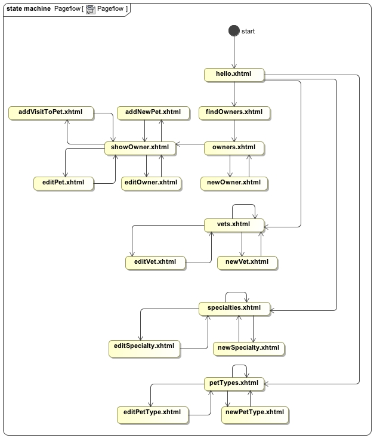
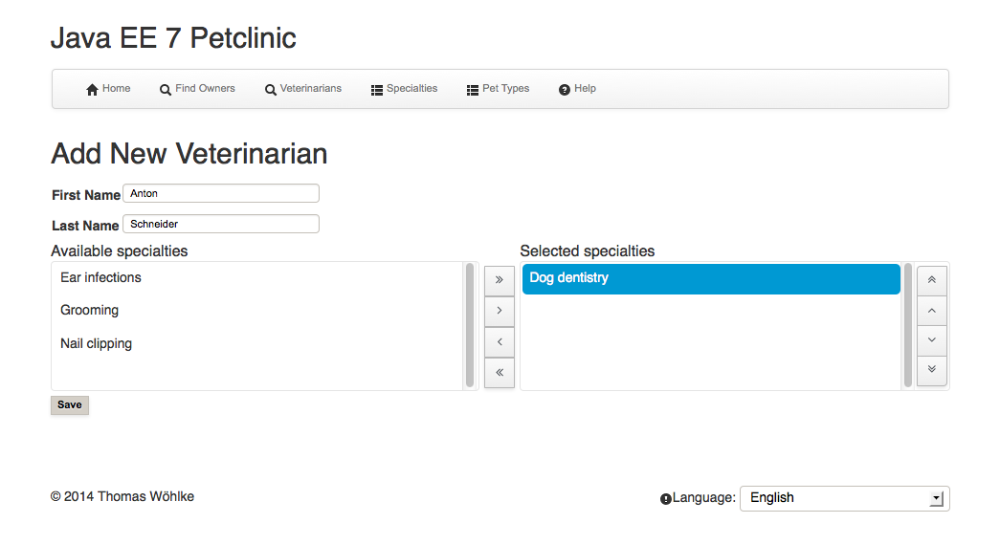
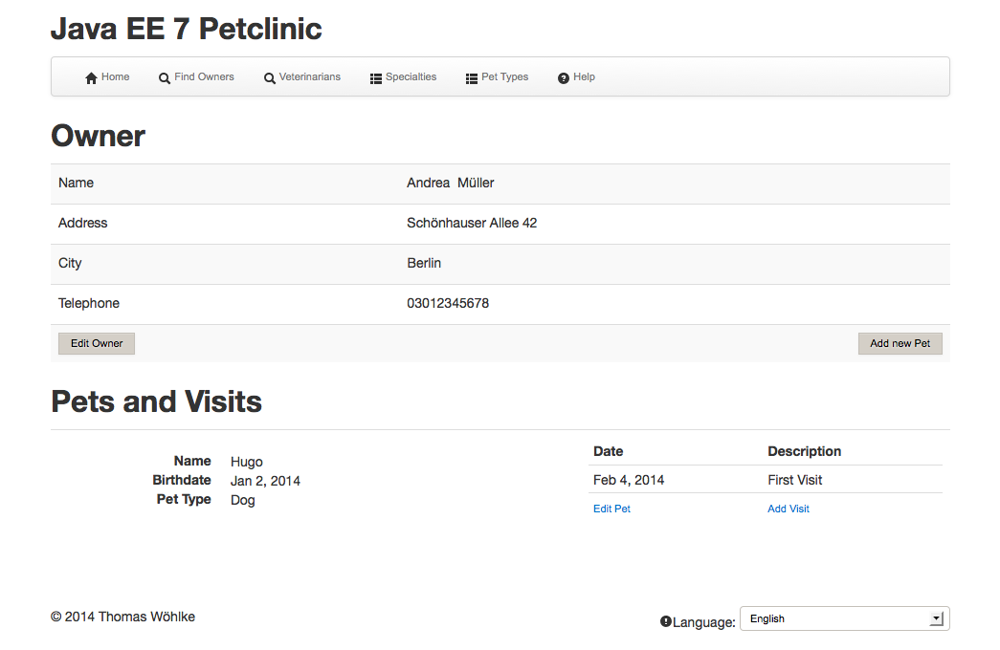

# jakartaee8-petclinic
Jakarta EE 8 Petclinic -  a JSF and Jakarta EE Version of Spring Petclinic -  and Update from Java EE 7 Petclinic
## What is this?
* JSF and Jakarta EE 8 Version of [Spring Petclinic](https://github.com/spring-projects/spring-petclinic)
* This is an Update of [Java EE 7 Petclinic](https://github.com/Jakarta-EE-Petclinic/javaee7-petclinic)
## Where is it?
* Github: [https://github.com/Jakarta-EE-Petclinic/jakartaee-petclinic](https://github.com/Jakarta-EE-Petclinic/jakartaee-petclinic)
* Demo on OpenShift: [http://jakartaee8petclinic.rhcloud.com/](http://jakartaee8petclinic.rhcloud.com)
* Blog: [http://thomas-woehlke.blogspot.de/2018/10/jakarta-ee-8-petclinic.html](http://thomas-woehlke.blogspot.de/2018/10/jakarta-ee-8-petclinic.html)
## Motivation
* Some experimental Work with JSF, Jakarta EE 8 and Java EE 8. 
* Comparison between Java EE / Jakarta EE and Spring Frameworks.
## Spring Petclinic
* Github: [https://github.com/spring-projects/spring-petclinic](https://github.com/spring-projects/spring-petclinic)

## More Developer Info
* [Jakarta EE 8](etc/JARTKARTA_EE.md)
* [Java jdk and jvm](etc/JAVA_JDK_AND_JVM.md)
* [Java Server Faces JSF](etc/JSF_PRIMEFACES.md)
* [Maven Plugins](etc/MAVEN.md)
## Development
* [Software Design](etc/Software_Design.md)
* [Maven Profiles and Git Branches](etc/PROFILES_AND_BRANCHES.md)
* [ToDo](etc/TODO.md)
* [Testing](etc/TESTING.md)
* [Source on Github](etc/SOURCE.md)
## Jakarta EE Runtimes
* [OpenLiberty](etc/RUNTIME_OPEN_LIBERTY.md)
* [Wildfly](etc/RUNTIME_WILDFLY.md)
* [Glassfish](etc/RUNTIME_GLASSFISH.md)
## Cloud
* [Openshift](etc/CLOUD.md)

# Software Design
## Domain Class Modell

## Use Cases

## Page Flow

## Screens
### Add Vet with ManyToMany Relation to Specialty

### New Visit

### Owner

## First Steps to use ##
* add some PetTypes like dog,cat,mouse,...
* add some Specialties for Vetinarians like dentist, anesthetist, radiology,...
* add a Vetinarian
* add an Owner, add him am a Pet and his Pet a visit.

## visit Spring Petclinic ##
* https://github.com/spring-projects/spring-petclinic

